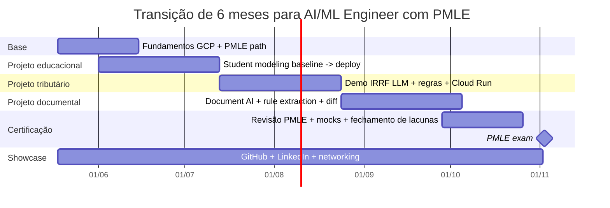

# Plano de transição em 6 meses para Gustavo Prado Oliveira rumo a AI/ML Engineer com foco na certificação Google Cloud Professional Machine Learning Engineer

## Resumo executivo

Para o seu perfil atual, a trilha com melhor combinação de **aderência técnica**, **empregabilidade** e **aproveitamento do que você já construiu** é **AI/ML Engineer / Applied ML Engineer**, com **Research Engineer** como trilha-alvo secundária de médio prazo e **Data Scientist** como trilha adjacente, não principal. O motivo é simples: o mercado segue puxando fortemente papéis ligados a IA aplicada e big data, e o seu histórico já mostra inclinação para **modelagem**, **arquitetura**, **validação**, **documentos complexos** e **operações com LLMs**, que são muito mais centrais em AI/ML Engineering do que em um papel de Data Scientist mais analítico e menos operacional. O Fórum Econômico Mundial lista especialistas em big data e especialistas em IA/ML entre os cargos de crescimento mais acelerado até 2030, e o LinkedIn mostra que a IA está acelerando a troca de habilidades nas funções de trabalho de conhecimento. citeturn12search13turn12search8turn12search6

A certificação **Google Cloud Professional Machine Learning Engineer** é um alvo coerente para essa transição porque, na versão oficial vigente a partir de **1º de junho de 2026**, ela cobra exatamente o que você precisa consolidar: **soluções de IA com GenAI**, **BigQuery ML/AutoML**, **prototipação em notebooks**, **experimentação**, **treinamento e serving**, **pipelines**, **monitoramento**, **segurança e IA responsável**, inclusive com ênfase em **prompt/context engineering**, avaliação de GenAI e proteção contra vazamento de dados e prompt injection. A prova tem **2 horas**, **50–60 questões**, custa **US$ 200 + impostos**, não tem pré-requisito formal e segue disponível em **inglês e japonês**. O próprio Google recomenda experiência prática em GCP, mas isso é “recommended experience”, não requisito eliminatório. citeturn5search0turn6view0

A recomendação operacional é esta: usar **conta pessoal como conta principal do Google Skills**, manter **perfil GitHub e portfólio pessoais**, e usar a conta institucional apenas quando fizer sentido para **programas acadêmicos, créditos de pesquisa ou iniciativas de faculty/research**. Isso porque as credenciais do Google Skills ficam como parte permanente da conta, podem ser compartilhadas publicamente e as contas **não podem ser mescladas**; por outro lado, o e-mail da conta **pode ser alterado** depois, o que preserva portabilidade. Além disso, o Google tem programas específicos para faculty/research com créditos e recursos adicionais. citeturn27view3turn27view4turn30search0turn30search1turn30search6

O plano abaixo assume **8–10 horas por semana** por 24 semanas. A meta realista é tentar a prova entre as **semanas 23 e 24**, desde que você chegue a três condições: **dois projetos deployáveis**, **um terceiro projeto muito bem documentado**, e **média de 80% ou mais nos mocks internos**. Se ficar abaixo disso na semana 20, a melhor decisão é adiar 2–4 semanas, porque a política oficial de retake impõe espera mínima e nova cobrança. citeturn4search2turn26search1

## Posicionamento de carreira

Seu doutorado em **modelagem do estudante** e recomendação educacional te dá profundidade em formulação de problema, métricas, experimentação e interpretação. Seus projetos aplicados com **LLM para tipificação e cálculo de IRRF**, inclusive com padrões como **cache-hit, cache-miss e unique-keys**, mostram que você já pensa em **sistemas híbridos**, **controle operacional**, **latência/custo** e **saída estruturada**. E a experiência da entrevista/case da Cielo mostrou uma inclinação forte para **arquitetura corporativa**, **rastreamento**, **versionamento**, **governança do dado** e **preservação semântica da regra**. Em resumo: você já tem material de AI aplicada; o que falta é **embalar isso no stack cloud-native, em MLOps e em portfólio público seguro**.

A diferença prática entre os papéis pode ser sintetizada assim, a partir das descrições oficiais de **Data Scientist**, **Machine Learning Engineer** e **Research Engineer**. citeturn27view1turn19search4turn27view0turn25search1

| Papel | Foco principal | Entregável típico | O que mais pesa | Melhor uso para seu perfil agora |
|---|---|---|---|---|
| **Data Scientist** | Extrair insight, modelar, interpretar, comunicar | análise, modelo exploratório, dashboard, experimento | estatística, EDA, inferência, visualização, narrativa analítica | **Adjacente**, mas subaproveita seu lado de arquitetura e produção |
| **AI/ML Engineer / Applied ML Engineer** | Construir, empacotar, implantar, monitorar e evoluir sistemas de IA | pipeline, API, modelo em produção, monitoramento, CI/CD | software engineering, MLOps, cloud, serving, confiabilidade | **Trilha principal recomendada** |
| **Research Engineer** | Transformar ideia de pesquisa em sistema experimental robusto | benchmark, infra experimental, paper/protótipo avançado | ML profundo, engenharia de sistemas, experimentação intensiva | **Trilha secundária/stretch**, especialmente em EdTech, recomendação ou Document AI |

A melhor leitura para você é: **Data Scientist te agrada intelectualmente, mas AI/ML Engineer te posiciona melhor no mercado e conversa melhor com o que você já fez**. Research Engineer faz sentido como extensão futura, especialmente se você quiser manter um pé forte em pesquisa aplicada, publicar e trabalhar em fronteira de modelos ou sistemas de recomendação/document understanding. O cargo de Research Engineer, nas descrições oficiais de Google DeepMind e OpenAI, demanda justamente essa ponte entre teoria, experimentação e implementação em escala. citeturn27view0turn25search1turn25search13

### Diagnóstico de lacunas

Hoje, sua base é forte em:

- formulação de problema e pesquisa;
- IA aplicada em educação;
- raciocínio híbrido com LLM + regras;
- organização conceitual de pipelines;
- comunicação técnica e didática.

As lacunas que mais importam para virar **AI/ML Engineer GCP-ready** em 6 meses são:

- empacotamento cloud-native em GCP;
- **BigQuery / BigQuery ML / Cloud Storage / Vertex AI / Cloud Run**;
- **CI/CD** com **Cloud Build** e imagens em **Artifact Registry**;
- **orquestração** com **Vertex AI Pipelines**;
- **monitoramento**, registro, linhagem e governança;
- segurança e IA responsável em aplicações com LLM;
- portfólio público com cara de produto, e não só de pesquisa.

## Competências-alvo e stack Google Cloud

A pilha que mais importa para o seu objetivo está muito alinhada à documentação oficial. O **Vertex AI** — agora evoluindo para **Gemini Enterprise Agent Platform** em partes do ecossistema — é a plataforma unificada para construir, implantar e escalar soluções de IA. O **BigQuery** é a plataforma de dados “AI-ready”, e o **BigQuery ML** permite treinar e executar modelos por SQL, inclusive integrando-se a recursos de IA. **Dataflow** faz o processamento batch/stream em escala; **Pub/Sub** viabiliza comunicação assíncrona por eventos; **Cloud Run** executa containers em modo serverless; **GKE** cobre os cenários em que você precisa de mais controle Kubernetes; **Vertex AI Pipelines** automatiza e governa workflows de ML; **Model Monitoring** acompanha qualidade/deriva; **Feature Store** gerencia e serve features; **Cloud Build** e **Artifact Registry** dão a espinha de CI/CD; **Document AI** transforma documentos não estruturados em dados estruturados; e **Model Armor** adiciona controles contra prompt injection, conteúdo nocivo e vazamento de dados em apps com LLM. citeturn0search1turn7search12turn7search7turn7search1turn7search6turn8search3turn8search0turn8search1turn9search12turn10search0turn10search1turn11search0turn9search1turn9search8

### Domínios da prova que devem guiar o plano

A nova versão oficial do guia do PMLE, válida a partir de **1º de junho de 2026**, reorganiza o exame em seis blocos que são um excelente mapa do que você precisa dominar. citeturn6view0

| Domínio do exame | Peso aproximado | O que isso significa para seu plano |
|---|---:|---|
| Arquitetar soluções de IA low-code | 13% | BigQuery ML, AutoML, seleção/avaliação de modelos, uso de APIs/Model Garden |
| Colaborar para gerenciar dados e modelos | 16% | dados, notebooks, experimentos, avaliação, privacidade |
| Escalar protótipos em modelos de ML | 21% | frameworks, treino, tuning, hardware |
| Servir e escalar modelos | 20% | endpoints, Cloud Run/GKE, registry, estratégias de rollout |
| Automatizar e orquestrar pipelines | 18% | Pipelines, CI/CD/CT, validação, reprocessamento |
| Monitorar soluções de IA | 13% | deriva, métricas contínuas, segurança, IA responsável |

O detalhe mais importante para você é que o novo guia já fala explicitamente em **soluções baseadas em modelos fundacionais**, **otimização de aplicações Gemini por custo/latência/disponibilidade**, **LLM-as-a-judge**, **Model Armor**, **malicious prompting**, além de **prompt/context engineering**. Isso conversa diretamente com os seus projetos de LLM. citeturn6view0

### Mapa de competências por papel e serviços GCP

A tabela a seguir é uma síntese prática de competências e produtos que mais importam para cada direção de carreira. Ela foi derivada das descrições oficiais de serviço do Google Cloud e das definições oficiais de função usadas acima. citeturn27view1turn19search4turn27view0turn0search1turn8search0turn8search1turn7search12turn11search0

| Competência | AI/ML Engineer | Data Scientist | Research Engineer | GCP mais relevante |
|---|---|---|---|---|
| Python e SQL | **essencial** | **essencial** | **essencial** | BigQuery, Colab Enterprise, Vertex AI Workbench |
| EDA e qualidade de dados | **essencial** | **essencial** | importante | BigQuery, Cloud Storage |
| BigQuery ML / prototipação low-code | **essencial** | **essencial** | opcional | BigQuery ML |
| Treinamento customizado | **essencial** | importante | **essencial** | Vertex AI / Agent Platform, GKE |
| Serving de modelos / APIs | **essencial** | opcional | importante | Cloud Run, Vertex AI endpoints, GKE |
| Pipelines e automação | **essencial** | opcional | importante | Vertex AI Pipelines, Cloud Build, Composer |
| Observabilidade e drift | **essencial** | importante | importante | Model Monitoring, Registry, Metadata |
| GenAI/LLMs aplicados | **essencial** | importante | **essencial** | Vertex AI / Agent Platform, Model Garden, Model Armor |
| Document understanding | importante | opcional | importante | Document AI, BigQuery ML |
| Pesquisa, benchmarks e experimentação profunda | opcional | importante | **essencial** | Workbench, Experiments, TensorBoard, GKE |

### O que você precisa provar ao final de 6 meses

Ao final do ciclo, você não precisa provar “domínio total do Google Cloud”. Você precisa provar, de modo convincente, que consegue:

1. **pegar um problema real e estruturá-lo em pipeline**;
2. **treinar ou integrar um modelo de forma justificável**;
3. **implantar algo executável**;
4. **monitorar, avaliar e explicar trade-offs**;
5. **fazer isso com boa engenharia e sem risco de PI**.

Se você conseguir mostrar isso em **três projetos bem embalados**, a certificação entra como validador — não como substituto do portfólio.

## Estratégia oficial de aprendizagem e decisão de conta

O eixo central do seu estudo deve ser o **learning path oficial do PMLE**, que hoje aparece com **20 atividades** no Google Skills. Como complemento, faz muito sentido usar três caminhos oficiais: **Beginner: Introduction to Generative AI** (5 atividades), **Advanced: Generative AI for Developers** (12 atividades) e **Deploy and Manage Generative AI Models** (7 atividades). O próprio Google também mantém a trilha geral de **Machine learning and AI** com cursos como **Introduction to AI and Machine Learning on Google Cloud**, além de cursos específicos de **MLOps** e materiais como o **Build a Certification Study Guide: PMLE**. citeturn21view0turn21view1turn21view2turn21view3turn31search2turn31search0turn13search3turn1view3

Há um detalhe operacional importante: o Google Skills e parte da documentação estão em fase de transição de nomenclatura de **Vertex AI** para **Gemini Enterprise Agent Platform**, e as próprias páginas oficiais alertam que você pode encontrar inconsistências nos nomes durante essa mudança. Isso importa porque você vai ver o mesmo conceito aparecer com nomes diferentes em cursos, docs e exame. citeturn21view0turn21view1turn21view2turn11search2

### Caminho oficial recomendado para você

| Recurso oficial | Papel no plano | Prioridade |
|---|---|---|
| Professional Machine Learning Engineer Certification path | espinha dorsal | **obrigatório** |
| Introduction to AI and Machine Learning on Google Cloud | base unificada de produtos e lifecycle | **obrigatório** |
| Beginner: Introduction to Generative AI | consolidar vocabulário e fundamentos | **muito recomendado** |
| Advanced: Generative AI for Developers | GenAI técnico, apps, padrões | **muito recomendado** |
| Deploy and Manage Generative AI Models | MLOps de GenAI | **muito recomendado** |
| MLOps: Getting Started / Model Evaluation | fechar lacuna operacional | **muito recomendado** |
| Sample questions + exam guide + webinars | preparação de prova | **obrigatório** |
| Official Study Guide | reforço teórico estruturado | opcional, mas útil |

Se você quiser manter a “porta Data Science” aberta sem desviar do objetivo principal, o melhor caminho não é trocar de trilha agora, mas adicionar um componente secundário e controlado depois do PMLE. O Google já oferece o **Associate Data Practitioner Certification** como trilha mais próxima do universo analítico, e também mantém o **Professional Data Engineer** como caminho complementar em pipelines e governança de dados. citeturn20search14turn13search15

### Conta institucional ou pessoal

Minha recomendação é: **conta pessoal como principal**, **conta institucional como apoio pontual**.

| Opção | Vantagens | Riscos | Recomendação |
|---|---|---|---|
| **Conta pessoal** | portabilidade, vínculo direto com LinkedIn/GitHub, independência do empregador, preserva histórico de longo prazo | você mesmo gerencia cobrança e acesso | **usar como conta principal** |
| **Conta institucional** | pode facilitar uso em programas acadêmicos, faculty/research credits e iniciativas institucionais | risco de perda de acesso futuro, fragmentação de histórico se criar conta separada | usar apenas quando houver benefício institucional concreto |

Essa recomendação decorre de três fatos oficiais: as credenciais do Google Skills ficam **permanentemente vinculadas à conta**, a conta pode **mudar de e-mail**, mas **duas contas não podem ser mescladas**. Ao mesmo tempo, Google Cloud mantém programas específicos para **faculty** e **researchers**, com créditos e recursos adicionais. A interface do Google Skills também permite trocar idioma para **português (Brasil)** e filtrar conteúdo por idioma, o que ajuda no estudo, embora a prova siga em inglês/japonês. citeturn27view3turn27view4turn28view0turn30search0turn30search1turn30search6turn5search0

### Estratégia de custo

Para reduzir custo, use três mecanismos oficiais:

1. **Google Cloud Free Trial** com **US$ 300** de crédito para novos clientes e oferta de produtos gratuitos;  
2. programas de **baixo ou nenhum custo** dentro do ecossistema de treinamento;  
3. quando disponível, iniciativas como **GEAR**, que informam **35 créditos mensais** de aprendizagem no Google Skills. citeturn23search0turn23search2turn23search6turn31search15

## Plano de 6 meses com marcos semanais

O plano abaixo foi desenhado para o exame vigente a partir de **1º de junho de 2026** e para a sua transição específica. A lógica é: **fundação → projeto preditivo → projeto GenAI/tributário → projeto de documentos/regras → observabilidade e certificação**. citeturn6view0turn21view0turn21view2turn21view3



### Mês de fundação

**Semana 1**  
Defina os títulos-alvo do currículo e LinkedIn como: **AI Engineer**, **ML Engineer**, **Applied ML Engineer**, com **Research Engineer** como stretch. Crie a conta principal do Google Skills, ajuste idioma para pt-BR, abra seu projeto pessoal de GCP com billing controlado e monte um repositório-mãe chamado `career-transition-portfolio`.  
**Entregável mensurável:** conta ativa, organização GitHub pronta, `roadmap.md` com 24 semanas.

**Semana 2**  
Conclua **Introduction to AI and Machine Learning on Google Cloud**. Monte um glossário pessoal mapeando **Vertex AI ↔ Gemini Enterprise Agent Platform**, **BigQuery ML**, **Cloud Run**, **Pipelines**, **Monitoring**, **Model Armor**.  
**Entregável mensurável:** `gcp-ml-cheatsheet.md` com 2–3 páginas e mapa de serviços.

**Semana 3**  
Faça **Beginner: Introduction to Generative AI** e execute um primeiro tutorial de **BigQuery ML** com dados públicos simples.  
**Entregável mensurável:** notebook ou script SQL executando treino e inferência ponta a ponta.

**Semana 4**  
Comece o **Projeto 1** com foco em student modeling: ingestão, dicionário de dados, baseline e critérios de avaliação.  
**Entregável mensurável:** `README` inicial, `DATA_CARD.md`, baseline reprodutível.

### Mês de projeto preditivo e primeira produção

**Semana 5**  
Aprofunde BigQuery ML e feature engineering; documente porque escolheu um baseline tabular antes de ir para algo mais sofisticado.  
**Entregável mensurável:** script SQL ou pipeline Python que recria features e treina o modelo.

**Semana 6**  
Implemente tracking de experimentos e compare dois modelos.  
**Entregável mensurável:** tabela comparativa de métricas e decisão justificada do “champion model”.

**Semana 7**  
Coloque o modelo em batch inference ou API simples. Se o deploy for via API, o default recomendado para você é **Cloud Run**, não GKE.  
**Entregável mensurável:** endpoint funcionando, container versionado, build automatizado.

**Semana 8**  
Faça o primeiro bloco de preparação para entrevistas: uma apresentação de 90 segundos da tese, uma de 90 segundos do app de IRRF e uma de 90 segundos do case documental/corporativo.  
**Entregável mensurável:** arquivo `interview_stories.md` com 6 histórias no formato STAR.

### Mês do projeto tributário com LLM

**Semana 9**  
Conclua os módulos essenciais de **MLOps** para implantação e automação, incluindo **Cloud Build** e **Artifact Registry**.  
**Entregável mensurável:** `Dockerfile`, `cloudbuild.yaml`, pipeline de CI funcional.

**Semana 10**  
Inicie o **Projeto 2**: versão pública e segura do seu app de IRRF, usando **dados sintéticos** e regras reescritas do zero.  
**Entregável mensurável:** gerador de dados sintéticos + módulo de regras determinísticas.

**Semana 11**  
Adicione a camada LLM com padrão **cache-hit / cache-miss / unique-keys**, deixando bem explícito o que é decisão do modelo e o que é validação/regra.  
**Entregável mensurável:** pipeline documentado, métricas de classificação, latência e taxa de cache.

**Semana 12**  
Faça deploy da demo em **Cloud Run**, registre logs estruturados e armazene resultados agregados no **BigQuery**.  
**Entregável mensurável:** demo API executável + dashboard simples de métricas.

### Mês do projeto documental e GenAI aplicada

**Semana 13**  
Entre na trilha **Advanced: Generative AI for Developers** e consolide padrões de prompt, grounding e avaliação.  
**Entregável mensurável:** `genai-patterns.md` com 10 testes de prompt e critérios de aceitação.

**Semana 14**  
Inicie prova de conceito com **Document AI** ou **ML.PROCESS_DOCUMENT** para PDFs públicos/sintéticos.  
**Entregável mensurável:** notebook que extrai campos ou trechos estruturados de PDF.

**Semana 15**  
Abra o **Projeto 3**, inspirado na sua experiência de case corporativo: extração de regras, normalização estruturada e comparação entre versões de documento.  
**Entregável mensurável:** engine de comparação semântica entre duas versões de PDF ou tabela.

**Semana 16**  
Adicione camadas de segurança e responsabilidade: políticas de dados, filtros de conteúdo, threat notes e ADRs.  
**Entregável mensurável:** `ADR-001.md`, `ADR-002.md`, checklist de risco para cada projeto.

### Mês de MLOps avançado e preparação forte para a prova

**Semana 17**  
Conclua **Deploy and Manage Generative AI Models** e prepare um pipeline de um dos projetos com registro, avaliação e artefatos.  
**Entregável mensurável:** especificação de pipeline e execução documentada.

**Semana 18**  
Adicione **Model Registry**, **metadata/lineage** e **monitoramento** ao projeto mais maduro.  
**Entregável mensurável:** captura de registry/lineage + relatório de monitoramento inicial.

**Semana 19**  
Produza seu guia final de estudos do PMLE: matriz domínio ↔ serviço ↔ projeto ↔ dúvida. Use o recurso oficial **Build a Certification Study Guide: PMLE** e complemente com seu próprio question bank.  
**Entregável mensurável:** `pmle-study-guide.md` + 100 flashcards/perguntas.

**Semana 20**  
Faça **dois mocks completos**.  
**Regra de decisão:** se média ≥ **80%**, mantenha a prova na semana 23; se <80%, remaneje a tentativa para as semanas 25–26 para evitar custo e janela de retake desnecessária.  
**Entregável mensurável:** planilha de acertos por domínio.

### Mês final de certificação, portfólio e aplicação

**Semana 21**  
Polimento final dos repositórios que ficarão fixados no perfil.  
**Entregável mensurável:** 3 repositórios com README forte, vídeo curto e instruções reproduzíveis.

**Semana 22**  
Rodada 2 de preparação para entrevistas: system design de serving, trade-off **Cloud Run vs GKE**, **BigQuery ML vs custom training**, **Pipelines vs Composer**, **LLM + rule engine**.  
**Entregável mensurável:** deck com 15 perguntas e respostas.

**Semana 23**  
Tentativa da certificação PMLE.  
**Entregável mensurável:** prova realizada.

**Semana 24**  
Feche o ciclo com candidatura e networking.  
**Entregável mensurável:** 10 aplicações customizadas, 5 mensagens de outreach, 1 post retrospectivo de ciclo.

## Portfólio, projetos e GitHub sem risco de PI

### Projetos recomendados

Os cinco projetos abaixo foram escolhidos para maximizar aderência ao seu histórico sem expor código, dados ou ativos sensíveis. Para os projetos educacionais, você pode usar **OULAD** e/ou **Student Performance (UCI)**. Para document understanding, **FUNSD** e **DocVQA** são boas bases públicas. citeturn24search3turn24search1turn24search9turn29search2turn29search4

| Projeto | Alinhamento com seu histórico | Dados | Métricas | Entregáveis públicos seguros |
|---|---|---|---|---|
| **Student Modeling on GCP** | tese de doutorado | OULAD ou UCI Student Performance | AUC-ROC, PR-AUC, Brier/calibração, slice metrics | pipeline BigQuery/Vertex, `MODEL_CARD`, relatório de explicabilidade |
| **IRRF LLM Demo** | app tributário com cache-hit/cache-miss/unique-keys | **sintético** (NFS-e, recibos, rubricas, códigos) | macro-F1, exact match de campos, MAE/MAPE do imposto, p95 de latência, hit-rate de cache | gerador sintético, rule engine, adaptador LLM, API Cloud Run, dashboard |
| **Rule Extraction from Public PDFs** | case documental/corporativo | PDFs públicos ou sintéticos de tabelas regras/termos | precisão/recall/F1 de extração, qualidade do diff, recall@k em recuperação | pipeline de parsing, schema de regra, comparador de versões, ADRs |
| **Educational Recommendation API** | tese + recomendação de atividades | OULAD + metadados públicos/sintéticos de materiais | NDCG@10, MAP@10, coverage/diversity | avaliador offline, API de recomendação, nota arquitetural |
| **Document Understanding Benchmark** | LLM + documentos + enterprise docs | FUNSD ou DocVQA | F1 de entidades/campos, exact match, robustez por tipo de layout | benchmark notebook, relatório comparativo, diagrama de arquitetura |

### Como estruturar seu GitHub

A forma mais forte para você não é despejar notebooks aleatórios, e sim montar uma **vitrine organizada por casos de uso**. Eu recomendo uma organização deste tipo:

- `gustavo-prado-ai-lab`  
  - `student-modeling-gcp`
  - `irrf-llm-demo`
  - `document-rule-extraction-demo`
  - `educational-recommendation-api`
  - `career-transition-portfolio`

Cada repo deve seguir uma estrutura previsível:

```text
.
├── README.md
├── LICENSE
├── .github/workflows/
├── docs/
│   ├── architecture/
│   ├── adr/
│   ├── diagrams/
├── src/
├── notebooks/
├── infra/
├── api/
├── tests/
├── eval/
├── data/
│   ├── raw/
│   ├── synthetic/
│   └── processed/
├── MODEL_CARD.md
├── DATA_CARD.md
└── DISCLAIMER.md
```

O arquivo `DISCLAIMER.md` é especialmente importante no seu caso. Ele deve explicar, em linguagem clara, que:

- o projeto usa **dados públicos ou sintéticos**;
- o código foi **reescrito do zero** para fins demonstrativos;
- não há artefatos institucionais, empresariais ou protegidos;
- nomes de parceiros/clientes/casos reais foram removidos.

### Template de README que funciona para seu perfil

Use sempre a mesma espinha:

1. **Problema**  
2. **Por que isso importa**  
3. **Escopo e o que este repo não contém**  
4. **Arquitetura**  
5. **Dataset**  
6. **Como reproduzir**  
7. **Avaliação**  
8. **Resultados**  
9. **Custos e limitações**  
10. **Riscos, ética e segurança**  
11. **Próximos passos**

Essa estrutura comunica bem tanto com recrutador técnico quanto com gerente.

### Cadência de LinkedIn sem risco de IP

A melhor cadência para você é **duas postagens por mês**, durante 6 meses, sempre centradas em **aprendizado técnico + evidência pública segura**. O próprio Google Skills destaca que credenciais podem ser compartilhadas em redes sociais e que isso é positivo para distinção profissional. citeturn27view3

Sugestão de calendário:

- **Mês 1:** transição de carreira + mapa do PMLE + BigQuery ML baseline  
- **Mês 2:** projeto de student modeling e por que código claro > “truques”  
- **Mês 3:** arquitetura de LLM + regras + cache-hit/cache-miss  
- **Mês 4:** parsing documental, regra semântica e versionamento  
- **Mês 5:** MLOps, monitoramento, model registry e trade-offs  
- **Mês 6:** retrospectiva do ciclo, portfólio e certificação

Formato ideal de post:

**problema → abordagem → aprendizado → imagem/diagrama → link para repo**  
Nunca: nome de cliente, print de dado real, trecho de contrato/edital sensível, prompt interno, custos de terceiros ou código proprietário.

## Certificação, entrevistas e networking

### Checklist priorizado para o PMLE

A preparação mais eficiente para a certificação é fortemente “official-first”, porque o Google declara formalmente que pode atualizar o conteúdo do exame para refletir mudanças tecnológicas. citeturn26search1

| Prioridade | Ação | Quando |
|---|---|---|
| **1** | Ler o **guia novo do exame** e transformar os 6 domínios em checklist pessoal | semana 1 |
| **2** | Inscrever-se no **PMLE path** e cursos-base | semana 1 |
| **3** | Fazer **sample questions** oficiais | semanas 3, 10 e 19 |
| **4** | Usar o curso **Build a Certification Study Guide: PMLE** | semana 19 |
| **5** | Revisar docs oficiais dos serviços que mais caem | contínuo |
| **6** | Fazer 2 mocks completos e revisar por domínio | semana 20 |
| **7** | Agendar a prova só depois de mock estável | semana 20 ou 21 |
| **8** | Fazer revisão final em inglês técnico | semanas 21–23 |

Seus recursos oficiais principais são: página da certificação, guia do exame, sample questions, learning path, webinars/Cloud OnAir e o study guide oficial citado pela própria página do exame. citeturn1view0turn19search1turn21view0turn13search3

Dois pontos práticos merecem atenção:

- a prova está apenas em **inglês/japonês**, então seus flashcards e seu “glossário de serviços” devem estar em **inglês técnico**; citeturn5search0  
- a certificação profissional vale por **2 anos**, e a política de retake exige espera mínima entre tentativas, com escalonamento do prazo em falhas subsequentes. citeturn26search1

### Preparação para entrevistas

Seu diferencial não será responder trivia de serviço, e sim explicar **trade-offs**. Treine especialmente estes tópicos:

- quando usar **BigQuery ML** versus **custom training**;
- quando escolher **Cloud Run** versus **GKE**;
- como separar **extração**, **validação** e **persistência** em pipelines com LLM;
- como decidir entre **RAG**, **extração estruturada**, **rule engine** e **model serving**;
- como monitorar um modelo tabular versus uma solução com LLM;
- como expor incerteza, confiança e critérios de fallback.

Transforme seus casos em narrativas curtas:

- **tese:** “como eu modelaria estudante/risco/recomendação como sistema”;
- **IRRF:** “como eu transformei ambiguidade textual em classificação estruturada com fallback determinístico”;
- **case documental:** “como eu preservei a semântica da regra e tratei versionamento, rastreabilidade e consulta”.

### Networking de maior retorno

Há cinco ambientes com melhor ROI para você:

- **Google Cloud / Developer Forums** e comunidade Google Cloud;  
- **Google Developer Groups** e eventos **Build with AI**;  
- **Google Cloud Innovators / Research Innovators**, quando houver janela e aderência;  
- **Kaggle**, para exposição crítica e benchmark público;  
- comunidades técnicas locais de Python/Dados/IA. citeturn15search5turn15search20turn15search2turn15search18turn30search6turn15search15

### Modelos curtos de outreach

**Conexão inicial**
> Olá, [Nome]. Estou direcionando minha transição para AI/ML Engineer com foco em Google Cloud e achei seu percurso muito alinhado ao que venho construindo em modelagem educacional, LLMs aplicados e MLOps. Gostaria de acompanhar seu conteúdo e aprender com sua trajetória.

**Pós-evento ou palestra**
> Obrigado pela palestra de hoje. O ponto sobre [tema] conversou muito com um projeto meu de [projeto]. Se fizer sentido, adoraria seguir sua trilha de materiais recomendados sobre [assunto].

**Pedido de feedback técnico**
> Olá, [Nome]. Estruturei um pequeno projeto público em GCP sobre [tema], com foco em [objetivo]. Se você tiver 5 minutos para um feedback de alto nível sobre arquitetura ou clareza do README, eu valorizaria muito.

## Riscos jurídicos, ética e propriedade intelectual

Aqui está o ponto mais sensível do seu caso.

Pelo regime jurídico do magistério federal, o regime de **40 horas com dedicação exclusiva**, em regra, implica impedimento do exercício de outra atividade remunerada. Ao mesmo tempo, o **Marco Legal de CT&I** criou hipóteses específicas para atuação do pesquisador público em atividades ligadas à pesquisa, inovação e interação com o ambiente produtivo. A aplicação concreta dessas exceções depende do vínculo, da forma de participação, da natureza da atividade e da regulamentação institucional. Por isso, o caminho seguro não é presumir permissão ampla nem proibição absoluta: é operar com **separação patrimonial, consulta formal e documentação de origem**. citeturn18search0turn18search1turn18search2

No seu caso específico, o IFTM mantém **NIT** ativo e lista formalmente sua política e normas de inovação e propriedade intelectual. Além disso, a própria minuta institucional disponível ao público explicita que criadores vinculados ao IFTM devem consultar o NIT sobre a conveniência de publicar resultados de projetos de PD&I passíveis de proteção intelectual. citeturn17view2turn16search0turn16search1

### Riscos principais e mitigação

| Risco | Impacto | Mitigação prática |
|---|---|---|
| Publicar código derivado de projeto institucional ou parceiro | conflito de PI / autoria / titularidade | publicar apenas versões **reescritas do zero** e consultar NIT/PROPI antes |
| Usar dados reais de municípios, estudantes ou documentos empresariais | risco de sigilo / dados sensíveis | usar **dados sintéticos** ou públicos anonimizados |
| Misturar conta pessoal e institucional em training/billing | perda de acesso / histórico fragmentado | conta pessoal principal; institucional apenas para créditos/programas específicos |
| Expor detalhes de caso real em GitHub/LinkedIn | risco reputacional e contratual | falar de **padrão arquitetural**, não de cliente, código ou dado |
| Usar LLM sem controles em dados sensíveis | vazamento, prompt injection, saída insegura | safety filters, revisão humana, dados sintéticos e arquitetura de proteção |

No lado técnico, a própria documentação do Google deixa claro que a segurança no Vertex AI é uma **responsabilidade compartilhada**, e o **Model Armor** existe justamente para mitigar prompt injection, conteúdo inadequado e vazamento de dados em aplicações de IA; a documentação de IA responsável também descreve filtros e sinais de segurança para modelos generativos. citeturn9search8turn9search1turn9search2

### Regra prática para suas publicações

Antes de publicar qualquer coisa, aplique esta checklist:

- o código foi escrito por você, do zero, fora de contexto protegido?  
- os dados são públicos ou sintéticos?  
- existe qualquer elemento que permita inferir cliente, processo, município, disciplina, estudante ou projeto institucional específico?  
- a postagem mostra **conceito/arquitetura/aprendizado**, e não ativo reaproveitável?  
- houve consulta ao **NIT/PROPI** quando o material puder ter valor de PI?

Se qualquer resposta for “não” ou “talvez”, não publique ainda.

## Recomendação final de trajetória

Se eu tivesse que transformar tudo isso em uma decisão de carreira objetiva, seria esta:

**trilha principal:** AI Engineer / ML Engineer / Applied ML Engineer  
**trilha secundária:** Research Engineer aplicado a educação, recomendação ou document understanding  
**trilha adjacente:** Data Scientist, mas como opção paralela e não central

O motivo não é abandonar a ciência de dados; é colocá-la **a serviço de uma trilha mais forte de entrega técnica**. Seu doutorado te dá densidade analítica. Seus projetos com LLM te dão aderência ao novo exame e ao mercado. O que mais vai mudar sua posição em 6 meses não é estudar mais teoria isolada, e sim **transformar essa base em sistemas públicos, limpos, reproduzíveis e cloud-native**. A certificação PMLE entra exatamente aí: como prova externa de que você não apenas entende IA, mas consegue **operacionalizá-la** em um stack moderno de mercado.